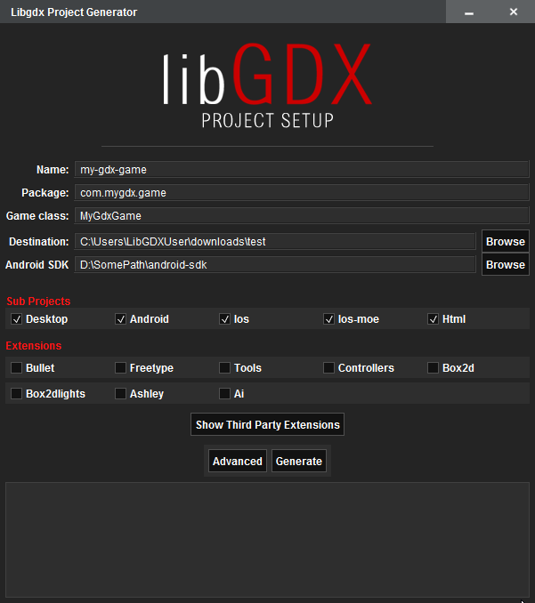

<h1> Creating a LibGDX project </h1>

LibGDX provides a simple wizard tool to allow you to get started with a minimal project.  This tool generates you a Gradle powered scaffold
that lets you run/deploy/debug from command line, or whatever IDE you like.

## Guide
- [Quick start](#quick-start)
- Extras
 - [Command line only generation](#command-line)
 - [Structure of LibGDX projects](#structure-of-libgdx-projects)
 - [What is Gradle?](#gradle)<br><br><br>

<hr>

## Quick Start
- Download LibGDX project setup tool [link](https://libgdx.badlogicgames.com/nightlies/dist/gdx-setup.jar)
- Open up your command line tool, go to the download folder and run 
<pre><code class="basic">java -jar gdx-setup.jar</code></pre>

This will open the following application


- **Name**<br>
  Name of your project
- **Package**<br>
  Java package for your application, usually a domain you own
- **Game class**<br>
  The main game class Name
- **Destination**<br>
  Destination for project generation
- **Android SDK**<br>
  Path to your Android SDK

<br>
#### **SubProjects**

Select which subprojects you want to generate.  These are the platforms you'd like to target. 

#### **Extensions**

Select the extensions you want included in your project.  The LibGDX maintained extensions area shown on the main page, they include:

- **[Bullet](https://github.com/libgdx/libgdx/wiki/Bullet-physics)**: 3D Collision Detection and Rigid Body Dynamics Library.<br>
- **[FreeType](https://github.com/libgdx/libgdx/wiki/Gdx-freetype)** Scallable font. Great to manipulate font size dynamically. However be aware that it does not work with HTML target if you cross compile for that target.<br>
- **[Tools](https://libgdx.badlogicgames.com/tools.html)** Set of tools including: particle editor (2d/3d), bitmap font and image texture packers.<br>
- **[Controller](https://github.com/libgdx/libgdx/wiki/Controllers)** Library to handle controllers (e.g.:XBox 360 controller).<br>
- **[Box2d](https://github.com/libgdx/libgdx/wiki/Box2d)**: Box2D is a 2D physics library.<br>
- **[Box2dlights](https://github.com/libgdx/box2dlights)**: 2D lighting framework that uses box2d for raycasting and OpenGL ES 2.0 for rendering.<br>
- **[Ashley](https://github.com/libgdx/ashley)**:A tiny entity framework.<br>
- **[Ai](https://github.com/libgdx/gdx-ai)**: An artificial intelligence framework.<br>

<br>
## Extras
<hr>

## Command line

You can also run the application on command line only by using the following:
<pre><code class="basic">java -jar gdx-setup.jar --dir dir-name --name app-name --package package --mainClass mainClass --sdkLocation SDKLocation [--excludeModules modules] [--extensions extensions]</code></pre>


Settings for the project (as above) are configured with the following options:
<pre><code class="basic">dir ... the directory to write the project files to
name ... the name of the application
package ... the Java package name of the application
mainClass ... the name of your main ApplicationListener
sdkLocation ... the location of your android SDK. Uses ANDROID_HOME if not specified. Ignored if android module is excluded
excludeModules ... the modules to exclude on the project generation separated by ';'. Optional
extensions ... the extensions to include in the project separated by ';'. Optional
</code></pre>

<hr>
## Structure of LibGDX projects

LibGDX projects generated by the setup tool have a multi module layout.  The layout will change slightly depending on what platforms 
you are targeting, but in general they look very similar. 

_Root project directory_
```
settings.gradle            <- definition of sub-modules. By default core, desktop, android, html, ios, ios-moe
build.gradle               <- main Gradle build file, defines dependencies and plugins
gradlew                    <- script that will run Gradle on Unix systems
gradlew.bat                <- script that will run Gradle on Windows
gradle                     <- local gradle wrapper
local.properties           <- Gradle only file, defines android sdk location
gradle.properties          <- Gradle properties file, defines Gradle settings such as daemon and RAM limits

core/
    build.gradle           <- Gradle build file for core project*
    src/                   <- Source folder for all your game's code

desktop/
    build.gradle           <- Gradle build file for desktop project*
    src/                   <- Source folder for your desktop project, contains Lwjgl launcher class

android/
    build.gradle           <- Gradle build file for android project*
    AndroidManifest.xml    <- Android specific config
    assets/                <- contains for your graphics, audio, etc.  Shared with other projects.
    res/                   <- contains icons for your app and other resources
    src/                   <- Source folder for your Android project, contains android launcher class

html/
    build.gradle           <- Gradle build file for the html project*
    src/                   <- Source folder for your html project, contains launcher and html definition
    webapp/                <- War template, on generation the contents are copied to war. Contains startup url index page and web.xml

ios/
    build.gradle           <- Gradle build file for the ios project*
    src/                   <- Source folder for your ios project, contains launcher

ios-moe/
    build.gradle           <- Gradle build file for the ios-moe project*
    src/                   <- Source folder for your ios project, contains launcher 
```


## Gradle

Gradle is a dependency management and build system.

A dependency management system is an easy way to pull in 3rd party libraries into your project, without having to store the libraries in your source tree. Instead, the dependency management system relies on a file in your source tree that specifies the names and versions of the libraries you need to be included in your application. Adding, removing and changing the version of a 3rd party library is as easy as changing a few lines in that configuration file. The dependency management system will pull in the libraries you specified from a central repository (in our case Maven Central) and store them in a directory outside of your project.

A build system helps with building and packaging your application, without being tied to a specific IDE. This is especially useful if you use a build or continuous integration server, where IDEs aren't readily available. Instead, the build server can call the build system, providing it with a build configuration so it knows how to build your application for different platforms.

In case of Gradle, both dependency management and build system go hand in hand. Both are configured in the same set of files. 