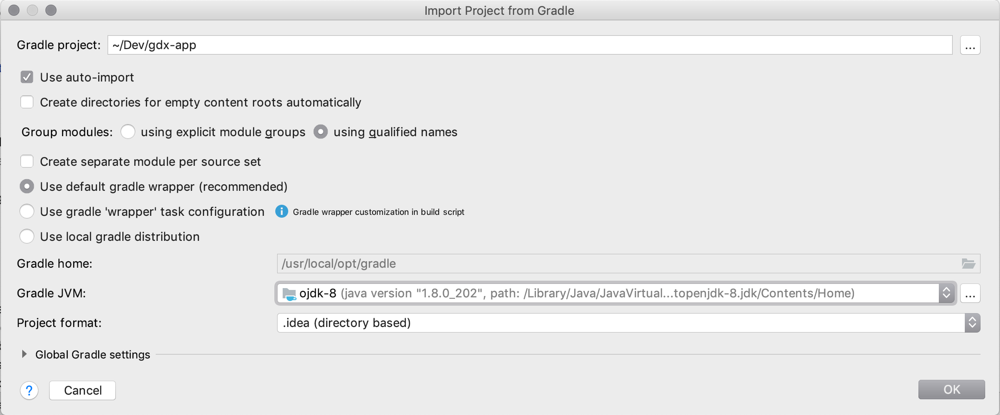
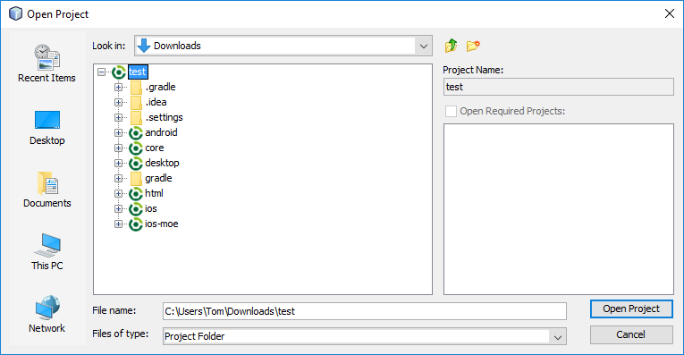

<h1> Importing a LibGDX project </h1>

Importing projects into your IDE should be painless if setup correctly.

    <strong>
    It is highly recommended that you use the Intellij IDE.
    </strong>

- [Importing into Intellij/Android Studio](#intellij)
- [Importing into Eclipse](#eclipse)
- [Importing into Neatbeans](#netbeans)

 

## Intellij

- File > Open > ProjectRoot/build.gradle
- Uncheck 'Create separate module per source set'
- Select OK on the 'Import Project from Gradle dialog'

- Import all modules

If you have any issues when importing, resolve these before continuing!

Once the project has imported you should run a Gradle sync in the IDE to make sure everything is OK.
To do this you bring up the Gradle tool window (View > Tool windows > Gradle), and hit the sync button, which is in the top left of the 
Gradle tool window.

If this succeeds, you are all imported and ready to get developing.

 

## Eclipse

- File > Import > Gradle.  As shown below

If you don't have this import setting available, <strong>stop</strong> and make sure you install BuildShip from eclipse before continuing.

- Select project root directory, hit finish.

If you have any issues when importing, resolve these before continuing!

## Netbeans

- File > Open Project > Select the project as shown below

- Wait for the project to fully load and configure.

